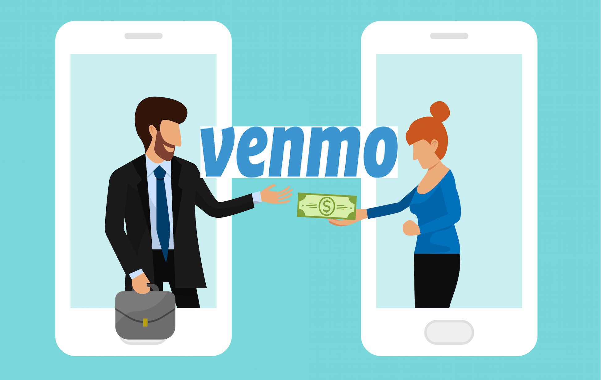

# Homework1

# *Venmo*

> "Ready, Set, Pay"

[https://venmo.com/]

## **Overview and Orgin**

Venmo was incorporated in 2009. 
The founders of Venmo were Andrew Kortina and Iqram Magdon-Ismail.

This company came about because two friends wanted to enhance the current software that a friend was using at their Frozen Yogurt store.They felt that it was inadequate with its traditional approach for the exchange of currency. This prompted them to create their first prototype for sending cash via a text message before they created the smartphone app, Venmo. 

Overtime as they redesgined and revised their models, they gained interest of larger investors, such as Paypal, who finacially supported further advancements to the app. 

This app was targeted for the younger population intially, specifically for college students splitting checks for movies, dinner, rent, etc. This is referred to as the Peer-To-Peer Market. Currently Venmo also offers more services due to its partnership with Mastercard. This now can involve businesses to set up instant payments without using physical currency. 

## **Funding**  

-In May 2010, the company raised $1.2 million in a financing round led by RRE Ventures.

-In 2012, the company was acquired by Braintree for $26.2 million.

-In December 2013, PayPal acquired Braintree for $800 million.

## **Business Activities**

Instantaneous Cashless Handling is the issue that Venmo continues to target to solve for our society.  

Venmo appeals to many different populations in our community. It appeals to the average college student, as well as businesses. 

Venmo differentiates itself from competitors by not charging a fee to send or receive transactions, unless they are through a credit card or for a business venure. Also, the limits for Venmo tranactions is $2999/week versus $500/week for Zelle. 

The major technology that Venmo uses is Automatic Clearing House (ACH) processing platform. 

## **Landscape**

Venmo is a combination of multiple domains. These major domains are: 

- Billing/Payments
- Personal Finance/Deposits/Online Banking
- Open Banking

Please review the statistics below to understand the trends of Venmo over the years.

-------------------------

_Venmo Revenue_

2015	$100 million*

2018	$200 million

2019	$300 million

2020	$450 million**

Note: * Estimated value ** Projected revenue by PayPal

-------------------------

Major competitors are:
- Cash App
- Zelle
- Skrill
- Fintiv
- Stripe
- Western Union
- Splitwise
- GooglePay
- PopMoney
- Square Cash
- FaceBook

The chart below shows how the major competitors compare with Venmo from 2016 to 2019. 

[https://infogram.com/venmo-vs-cashapp-vs-zelle-1h984we0d5xd4p3]

As we can see, Venmo is below Zelle and Square, but still very competitive! 

## **Results**

Venmo has had a major business impact. It gives millenials and business owners the opportunity to use a simple and intuitive interface in money exhcange. Small businesses such as decorators and owners renting out properties utilize Venmo. It helped open up networks to trend towards a _Cashless Economy._

Some of the major metrics that Venmo focuses on are its revenue, number of users, and security. Overall, Venmo is doing well, but there needs to be more focus on security. 

## **Recommendations**

Primarly, I would recommend that the company focuses on the security of payments during tranactions and advertises this security. Although, just like other platforms Venmo uses data encryptions, publically there have been many discussions of its security. One of the differences between Zelle and Venmo is that Zelle is a bank-backed application. One of the benefits of Venmo is that it is backed by PayPal which has been trusted in the market for 20+ years. Due to Zelle being bank-based, it tends to gain trust from users quicker than Venmo. 

## **References**

- https://www.businessofapps.com/data/venmo-statistics/
- https://venmo.com/
- https://thehustle.co/how-venmo-started
- https://www.forbes.com/sites/donnafuscaldo/2020/01/30/paypal-all-in-with-venmo-in-2020/?sh=5fc92f363599
- https://www.investopedia.com/articles/personal-finance/010715/venmo-its-business-model-and-competition.asp
